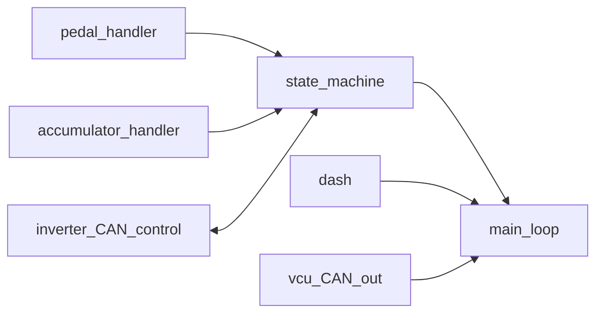

# design 

```mermaid
    graph LR;
        state_machine --> main_loop;
        dash --> main_loop;
        vcu_CAN_out --> main_loop;
    
        pedal_handler --> state_machine;
        accumulator_handler --> state_machine;
        inverter_CAN_control <--> state_machine;

```