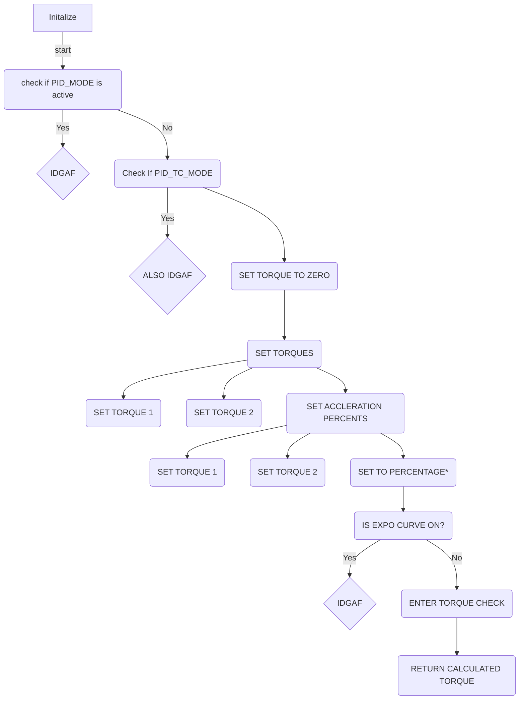

# design 

the vcu CAN out is still TODO mostly, currently it spits out all RX / TX traffic

below is a loose flow of the data and what handles what

This is tha basic of the state machien. 
    the car is set to state

